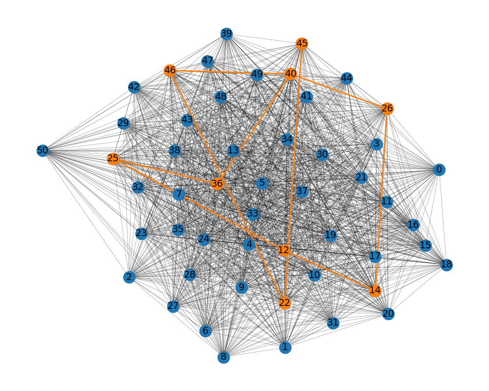

# Deepwalk-SSP  

Deepwalk-SSP is a Python repository that implements a novel approach for student representation using DeepWalk, a network representation learning technique. The repository contains the code and data used in the paper "DeepWalk for Student Sectioning" submitted to the Knowledge-Based Systems journal.  

## Requirements  

* Python 3.10
* NetworkX 3.3  
* NumPy 1.24+  
* Scikit-learn 1.5+  

## Getting Started  

1. Clone the repository using `git clone https://github.com/mamintoosi/Deepwalk-SSP.git`  
2. Install the required libraries 
3. Open the `Deepwalk-SSP.ipynb` Jupyter Notebook and run the cells to reproduce the experiments  

## Data  

The dataset used in the paper is included in the `data` folder.

## Usage  

The `Deepwalk-SSP.ipynb` Jupyter Notebook is the main entry point of the repository. Running the notebook will execute the code and produce the results reported in the paper.